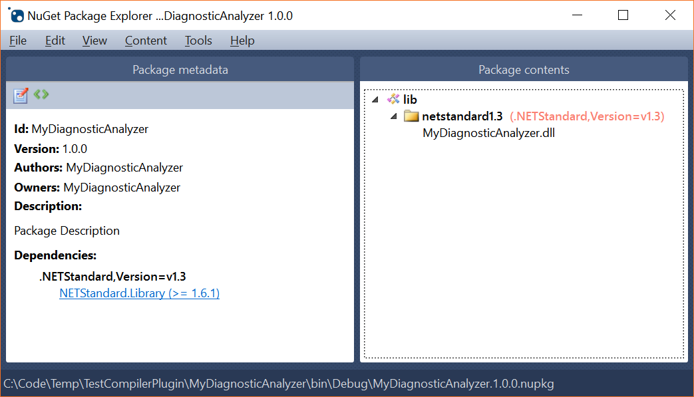
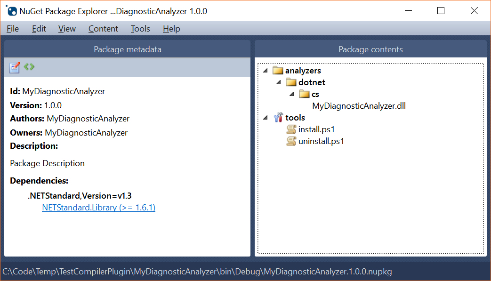

# AnalyzerPack [](https://ci.appveyor.com/project/xoofx/AnalyzerPack) [](https://www.nuget.org/packages/AnalyzerPack/)

AnalyzerPack is a nuget package that will automatically create a package for your Roslyn Diagnostic Analyzer when performing a `dotnet pack` on your project.

## Why?

Today, when you create a Roslyn Diagnostic Analyzer using the new project format, it can create a NuGet package, but this package is a standard .NET package and not compatible with a Diagnostic Analyzer package that expect a specific layout of your package (e.g DLL must be moved to `analyzers\dotnet\cs`)
In order to publish your package as a compatible Roslyn package, you need to create a specific `nuspec` file, build your project and build your `nupkg` from your custom `nuspec`.

With AnalyzerPack, you can keep your project as it is, but when performing a `dotnet pack` it will automatically match the expected layout of a Roslyn Diagnostic Analyzer package.

Your resulting diagnostic assembly DLL will be moved to the folder `analyzers/dotnet/cs` inside the NuGet package.
It will also add automatically the `tools\install.ps1`, `tools\uninstall.ps1` files.

| Standard Package | With AnalyzerPack
|------------------|------------------
|  | 

## Usage

Simply reference AnalyzerPack into your project:

```xml
<PackageReference Include="AnalyzerPack" Version="1.*" PrivateAssets="all" />
```

And when performing a `dotnet pack` on your project (or from Visual Studio), it will automatically generate the proper folder structure for the NuGet diagnostic analyzer.

You will see the following message if the package succeeded:

```
AnalyzerPack successfully prepared your package as a Roslyn Diagnostic Analyzer
```

## Known Limitations

- Might not work with old non SDK project format.
- Your project requires to have only a single `TargetFramework` configured (multiple target frameworks are not supported)
- Maybe only working with `csproj` due to the hardcoded value `analyzers/dotnet/cs`, need to check that

## License 

MIT

## Author

Alexandre MUTEL aka [xoofx](http://xoofx.com)
